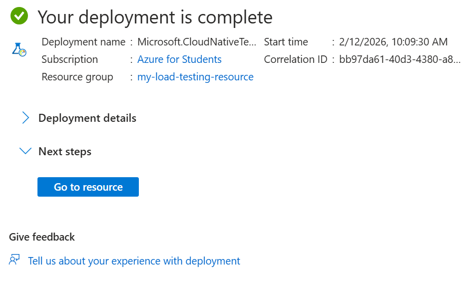
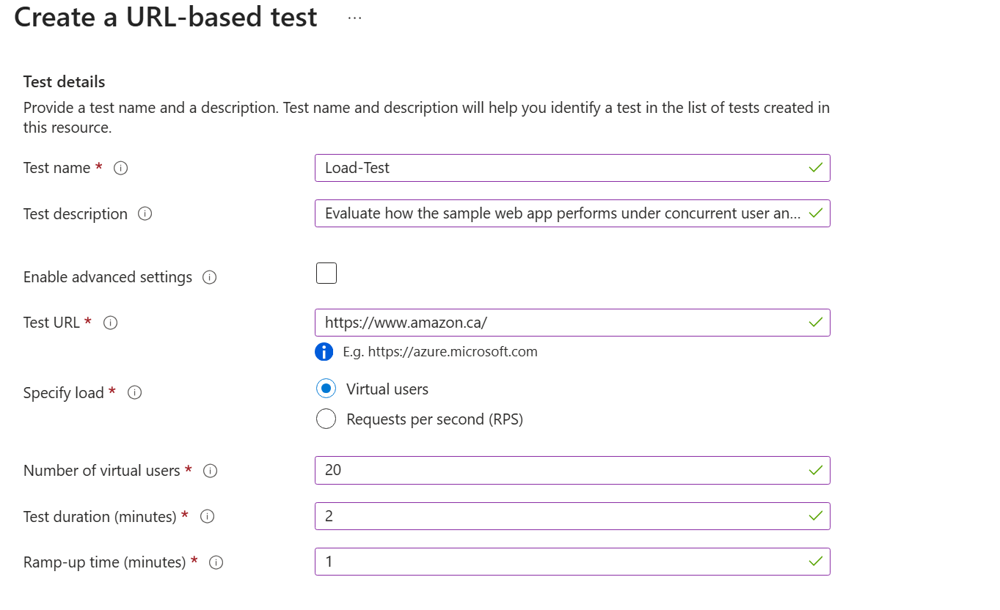
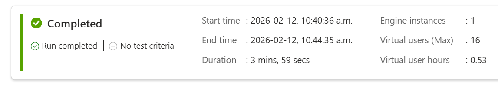
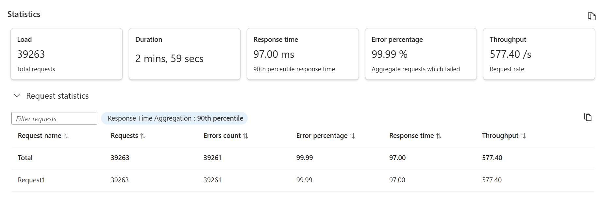
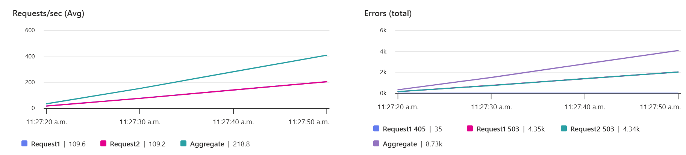

# Azure Load Testing Project

## Overview
This project demonstrates how to design, execute, and analyze performance tests using **Azure Load Testing**. It includes configuring a load test, running it against a sample target endpoint provided by the Microsoft Learn quickstart, analyzing performance metrics, and documenting findings.  
The goal is to showcase practical cloud engineering and cloud security skills through performance testing, monitoring, and secure access control.

---

## Technologies Used
- Azure Load Testing  
- Azure Portal  
- URL-based test configuration (no scripting required)
- Azure Monitor (metrics and logs)  

---

## Test Configuration
**HTTP Method:** GET  
**Virtual Users:** 20  
**Test Duration:** 2 minutes  
**Ramp-Up Time:** 1 minute  
**Test Type:** URL-based test (configured entirely in Azure Portal)

These values were selected to stay within student/free-tier limits while still generating meaningful performance data.

---

## Steps Performed
1. Created an Azure Load Testing resource in the Azure Portal.  
2. Configured a URL-based test by specifying the endpoint and load parameters.
3. Ran the baseline load test (successful).  
4. Enabled advanced settings and added an additional GET request.
5. Reran the test (resulted in failures).  
6. Captured screenshots of both successful and failed runs.  
7. Deleted the resource group to avoid unnecessary costs.

---
## Project walkthrough (screenshots)

This section visually documents the key stages of the Azure Load Testing quickstart, from resource creation to test execution and analysis.

### 1. Creating the Azure Load Testing resource

This screenshot shows the process of creating the Azure Load Testing resource. It includes selecting the subscription, creating the resource group **my-load-testing-resource**, naming the instance, and choosing the East US region. Creating this resource is essential because it provides a centralized place to manage tests, view results, and store related artifacts.

---

### 2. Deployment completed

This screenshot confirms that the Load Testing resource was successfully deployed. At this point, the environment is fully provisioned and ready for test creation and execution.

---

### 3. Creating a URL-based test (GET request)

Here, the URL-based test is configured with the following parameters:
- **HTTP Method:** GET  
- **Virtual Users:** 20  
- **Duration:** 2 minutes  
- **Ramp-up:** 1 minute  
- **Target URL:** Public endpoint  

This type of test requires no scripting and is configured entirely through the Azure Portal.

---

### 4. Baseline test run completed (successful)

This screenshot shows that the baseline test completed successfully with no errors. Metrics such as response time, throughput, and virtual user activity indicate that the endpoint handled the simulated load as expected.

--- 

### 5. Failed test run (auto-stop triggered)

After modifying the test and adding an additional request, Azure automatically stopped the run due to repeated failures. Auto-stop helps prevent unnecessary resource usage and protects the target endpoint from excessive or invalid traffic.

---

### 6. Failed test statistics

This screenshot highlights the error rate, throughput drop, and response time issues that occurred during the failed run. These metrics help identify misconfigurations or invalid endpoints introduced during the test modification.

---

### 7. Multiple HTTP requests (advanced settings)

This screenshot shows the advanced configuration where additional GET requests were added to the test. These changes led to the failure scenario, demonstrating how Azure Load Testing surfaces issues when multiple endpoints or request types are introduced.

---

## Baseline Test Results (Successful)
The initial test ran successfully with no errors.

### **Observations**
- The target endpoint responded consistently under load.  
- Response times remained stable throughout the test.  
- Throughput was steady and predictable.  
- No performance degradation or failures were observed.

Screenshots are included in the `/Screenshots` folder.

---

## Modified Test Results (Failed)
After adding an additional request to the URL-based test, the test began failing consistently.

### **Possible Causes**
- The added request targeted an invalid or non-existent endpoint.  
- Missing headers or authentication requirements.  
- The sample endpoint rejected the request.  
- The URL-based test configuration became invalid after modification.

### **Why This Is Valuable**
Load testing is meant to reveal failure points.  
These failures demonstrate how Azure Load Testing surfaces errors and helps diagnose issues — a realistic part of performance engineering.

---

## Comparison: Baseline vs. Modified Test

| Aspect | Baseline Test | Modified Test |
|--------|----------------|----------------|
| Status | Successful | Failed |
| Errors | None | Multiple request failures |
| Throughput | Stable | Dropped due to errors |
| Response Time | Consistent | Not measurable due to failures |
| Interpretation | Endpoint handled load well | Added request likely invalid |

---

## RBAC & Access Control (Cloud Security)

Azure Load Testing can generate significant traffic, so access must be controlled using **Azure Role-Based Access Control (RBAC)**.

### **Key Roles**
- **Load Test Contributor** – Can create and run tests.  
- **Load Test Reader** – Can view results only.  
- **Owner/Contributor** – Too broad; avoid assigning for load testing.

### **Security Best Practices**
- Apply **least privilege** when assigning roles.  
- Restrict who can run tests to prevent accidental overload.  
- Use resource group isolation for load testing resources.  
- Monitor activity logs to track who executed tests.  
- Avoid storing secrets in test scripts; use Azure Key Vault if needed.

---

## API Security Considerations

When load testing APIs, it’s important to maintain security posture.

### **Key Considerations**
- **Rate Limiting:** Ensure tests do not unintentionally trigger API throttling.  
- **Authentication:** Never hardcode API keys or tokens in scripts.  
- **WAF/Bot Protection:** Load tests may be blocked by WAF rules; whitelist only if approved.  
- **Environment Safety:** Avoid testing production APIs.  
- **Monitoring:** Observe logs and alerts during tests to detect anomalies.

### **Why This Matters**
Load testing can resemble malicious traffic. Proper planning ensures performance testing does not compromise security controls.

---

## Findings & Observations
- The application handled the baseline load without issues.  
- The modified test revealed how invalid requests can cause failures.  
- Azure Load Testing provides clear visibility into performance and errors.  
- RBAC and API security considerations are essential when running load tests in real environments.

---

## Improvements & Next Steps
- Run additional tests with different load patterns.  
- Test authenticated endpoints using secure secret storage.  
- Add Azure Monitor alerts for error spikes or unusual traffic.  
- Expand the project with a small architecture diagram.  
- Integrate load testing into a CI/CD pipeline (future enhancement).

---

## Skills Demonstrated
- Azure Load Testing configuration  
- Performance metrics analysis  
- Cloud security best practices (RBAC, API security)  
- Technical documentation  
- Resource cleanup and cost management
  
## Cleanup
After completing the project, I deleted the resource group to avoid unnecessary costs.

## Architecture Overview

The diagram below illustrates the high-level architecture of this Azure Load Testing project.

